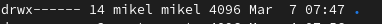
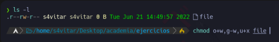
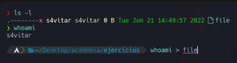
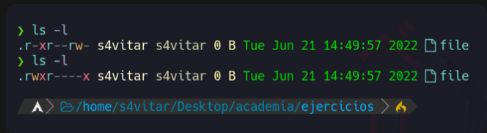
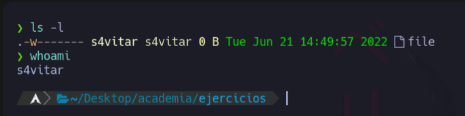

# Baimenak Linux
- [Baimenak Linux](#baimenak-linux)
  - [Fitxategi eta direktorioen baimenak](#fitxategi-eta-direktorioen-baimenak)
    - [Baimen taldeak](#baimen-taldeak)
    - [Baimenak esleitzen modu simbolikoan](#baimenak-esleitzen-modu-simbolikoan)
    - [Baimenak modu oktalean](#baimenak-modu-oktalean)
  - [Sticky bit baimena](#sticky-bit-baimena)
  - [SUID eta GUID baimenak](#suid-eta-guid-baimenak)
    - [Suid](#suid)
  - [Ezaugarri bereziak - lsattr eta chattr](#ezaugarri-bereziak---lsattr-eta-chattr)
- [Ariketa](#ariketa)
  - [Ariketa 1](#ariketa-1)
  - [Ariketa 2](#ariketa-2)
  - [Ariketa 3](#ariketa-3)
  - [Ariketa 4](#ariketa-4)
  - [Ariketa 5](#ariketa-5)
  - [Ariketa 6](#ariketa-6)
  - [Ariketa 7](#ariketa-7)

## Fitxategi eta direktorioen baimenak

Fitxategi eta direktorioen baimenak hurrengo aginduarekin ikusi ditzakegu.

```bash
ls -al
```


### Baimen taldeak

**Jabea (user):** Fitxategi bat sortzen dugunean, sortzailea jabea izango da defektuz.
**Taldea (group):** Fitxategi baten jabetza talde bati ere bai dagokio
**Besteak (other):** Jabeak edo taldekideak ez direnak


### Baimenak esleitzen modu simbolikoan

Linuxen baimen motak eta `chmod` aginduaren erabilera azalduko ditut:

1. **Baimen Motak**:

   - **Read (Irakurri)**: Erabiltzaileak fitxategia irakurri dezake.
   - **Write (Idatzi)**: Erabiltzaileak fitxategia editatu, eguneratu edo ezabatu dezake.
   - **Execute (Exekutatu)**: Erabiltzaileak fitxategia exekutatu dezake, hau da, script-ak, programa-k edo karpeta-k exekutatu ditzake.
   
   Baimen mota hauek erabilzaile bakoitzari aplikatu daitezke, eta baimenak fitxategiaren jabetza, taldearen jabetza eta beste erabiltzaile batzuen baimenak izan daitezke.

2. **`chmod` Agindua**:

   `chmod` komandoa erabiliz, fitxategien baimenak aldatu ditzakegu. Oinarri hauek dira:

   - **Oinarriak**:
     - **`u`**: Fitxategiaren jabea (owner).
     - **`g`**: Fitxategiaren taldea (group).
     - **`o`**: Beste erabiltzaile batzuk (others).
   
   - **Operazioak**:
     - **`+`**: Baimena gehitu.
     - **`-`**: Baimena kendu.
     - **`=`**: Baimenak zehaztu.
   
   - **Baimen Motak**:
     - **`r`**: Irakurketa baimena.
     - **`w`**: Idazketa baimena.
     - **`x`**: Exekuzio baimena.

   Adibideak:

   ```bash
   # Erabiltzaileari idazketa baimena gehitu fitxategian
   chmod u+w fitxategia.txt
   
   # Erabiltzailearen exekuzio baimena kentzea script-ari
   chmod u-x script.sh
   
   # Erabiltzaileei irakurketa eta exekuzio baimenak ezarri programa bati
   chmod ug+rx programa
   
   # Guztiei exekuzio baimena ezarri fitxategi bati
   chmod a+x fitxategia
   ```

Honek baimen motak kontrolatzeko aukera ematen dizu, hau da, nork norki zein baimenak dituen eta zer ekintzak egin ditzakeen fitxategi edo karpeta batean.

Adibidea, jabeari (user): exekutatzeko baimen horrela eman ahal diogu
```bash
chmod u+w text.txt
```
Honela, taldeari eta bestei exekutatzeko eta idazteko baimenak emango diogu.

```bash
chmod go+wx  text.txt
```
Bestei, irakurtzeko baimena horrelo kendu diezaiokegu 
```bash
chmod o-r text.txt
```

### Baimenak modu oktalean

- 0 = 000 = --- baimenarik gabe
- 1 = 001 = -x = exekutazio baimena
- 2 = 010 = w = idazeteko baimena
- 3 = 011 = wx = idazteko eta exekutzeko 
- 4 = 100 =r = irakurtzeko baimena
- 5 = 101 =r-x = irakurtzeko eta exekutzteko baimena 
- 6 = 110 =rw = irakurtzeko eta idazteko baimena 
- 7 = 111 = rwx = irakurtzeko, idazteko eta exekutatzeko baimena

Adibidez baimen guztiak kentzeko
```bash
chmod 000 froga.txt
```

Baimen guztiak gehitzeko

```bash
chmod 777.froga.txt
```

Etabiltzaileari baimen guztiak emateko eta besteei edo taldekidei irakurtze eta exekutazio baimenak emateko.

## Sticky bit baimena
Sticky bit daukan fitxategia edo direktorio bat bakarrik jabea edo rootek aldatu ahal dio izena edo ezabatu ahal du.

Sticky bia jartzeko
```bash
chmod +t text.txt
```
Sticky bia kentzeko

```bash
chmod -t text.txt
```


## SUID eta GUID baimenak

### Suid
 Suid aktibatuta dagoenean fitxategi hau exekutatzen duen erabiltzaileak sortzailearen baimenak izango ditu

 ```bash 
 chmod u+s text.txt
 ```

 Sortu exekutable bat hurrengo edukiarekin

 suidtext.sh
 ```bash
 #!/bin/bash
 echo erabiltzailea
 id
 echo exekuzioa baimen erabiltzailea
 echo $EUID
 ```

 Baimenak esleituko dizkiogu fitxategiari
 ```bash
chmod 755 suidtext.sh
 ```
 
 Ezarri SUID suidtext.sh fitxategiari

 ```bash
 chmod u+s suidtext.sh
 ```
 ```bash
 chmod 4755 suidtext.sh
 ```

## Ezaugarri bereziak - lsattr eta chattr

Ezaugarri bereziak ikusteko `lsattr` agindua erabiliko dugu

Ezaugarri bereziak aldatzeko `chatttr` agindua erabiliko dugu

Adibidez i atributuaren fitxategi bat inmutable bilakatzen digu. Hau esan nahi du inork ezin duela  ezabatu, ezta root-ek. Ezabatu nahi izaterakoan, i atributoa ken  beharko genioke lehenago.
```bash
chattr +i text.txt
lsattr text.txt
```

**u** ezaugarriarekin fitxategi bat ezabatzen dugunean datuak gordeta gelditzen dira eta bere  berreskurapena ahalbidetzen du.
```bash
chattr +u text.txt
```

**e** ezaugarriarekin fitxategi bat ezabatzen duenean, okupatzen zuen memoria zeroekin berridazten da.
```bash
chatttr +e text.txt
```

**c** ezaugarriarekin komprimituta gordeko da.
```bash
chattr +c text.txt
```

**a** ezaugarriarekin fitxategi bati bakarrik gehitu ahal zaizkio gauzak, hau da aldatu aurretik zegoen ezer
```bash
chattr +a text.txt
```

# Ariketa

## Ariketa 1
Lotu dagokion baimenerekin

- 462
- 123
- 711
- 333
- 161
- 765
- 567
- 101
- 162

- rwx--x--x  711
- --x-w-wx 123
- --x-----x 101
- -wx-wx-wx 333
- r-xrw-rwx 567
- rwxrw-r-x 765
- --xrw--w- 162
- r--rw--w- 462
- --xrw---x 161


## Ariketa 2 

Zein da fitxategi honen baimenen baimena modu oktalean?



Bai, zeren eta rw erabiltzen dugu, irakurtzeko eta idazteko baimena da modu oktalean.

## Ariketa 3 

Jarri hurrengo baimenak modu oktalean

- r--r-xrw-     :464
- --xr-xr--     :701
- r--------     :400
- --------x     :001
- rwsr-xr-x     :475
- rwxr-sr-x     :751
- r--rw---t     :4601
  
  ## Ariketa 4
  
  Zer gertatuko da hurrengo agindua exekutatzerakoan?



'Whoami' komandoaren output-a file fitxategian gordeko da, fitxategiaren jabea izateagatik baimenek ez baitidate eragiten

'Whoami' komandoaren output-a ezin izango da file fitxategian gorde, jabea izan arren, fitxategian esleitutako baimena gailentzen delako
  
Aurreko komandoa exekutatuko da eta bere emaitza file izeneko fitxategian idatzi egingo da. File izeneko fitxategian erabiltzailearen izena idatziko da.

## Ariketa 5
Nola lortuko zenuke "file" artxiboaren baimenak ikusten den moduan aldatzeko?



chmod 741 froga.txt

## Ariketa 6
Zortzitarrean zer baimen esleitu beharko dut artxiboak adierazitako baimenak izan ditzan lortzeko?


chmod 624 (karpetaren izena)

## Ariketa 7
Honako baimen hauek konfiguratuta dituen fitxategi hau ezabatu ahal izango dut?


Bai


